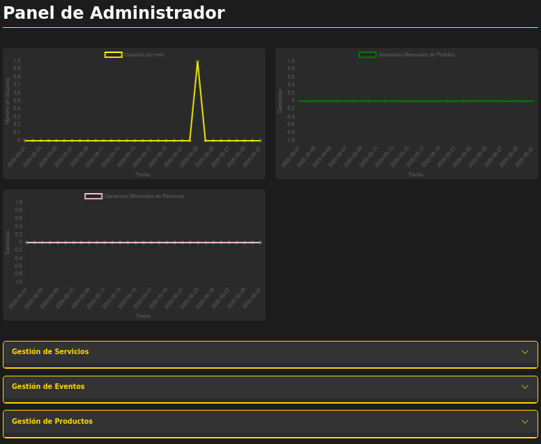
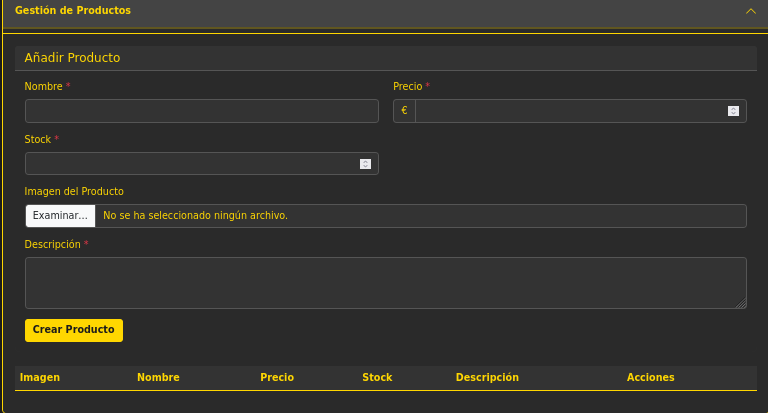
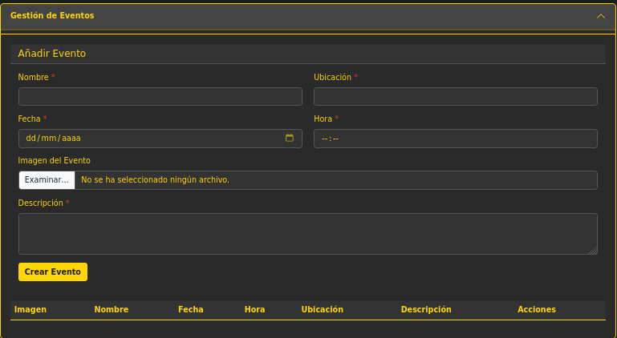

# Guia de Admin

En el admin es una pantalla de gestion que solo esta disponible cunaod tu rol es Admin y te muestran diferentes graficas de ganancias y de registros de usuarios ademas de que en los desplegables puedes añadir, editar o eliminar de la base de datos productos, services y eventos perimitiendo asi una forma mas accesible de que se administre la pagina.

