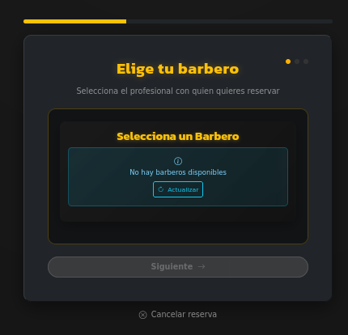
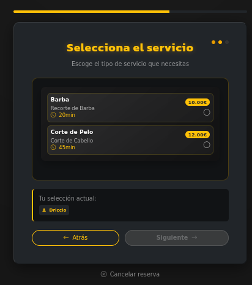
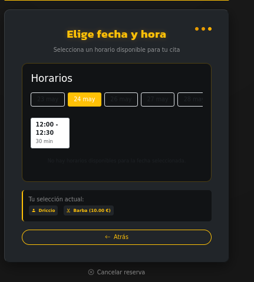

# Guia para Bookings

En la creacion de bookings decidimos que se hiciera en tres pasos para asi poder comprobar si los barberos estaban disponibles y despues saber que horas y dias tenian disponibles por ello se divide en tres parte el formulario ademas para que la persona que quiera reservar le resulte mas facil y rapido.

Esta es la primera parte del formulario donde se pide la eleccion de barbero.

En la segunda permite elegir el servicio que quieres.

Y por ultimo se pide la fecha y hora de la reserva.

Y tras añadir te devuelve a el [landing](landing.md) y para ver las reservas debes acceder al [perfil](profile.md) aunque tambien se te envia un correo con la fecha y hora.
