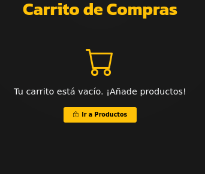
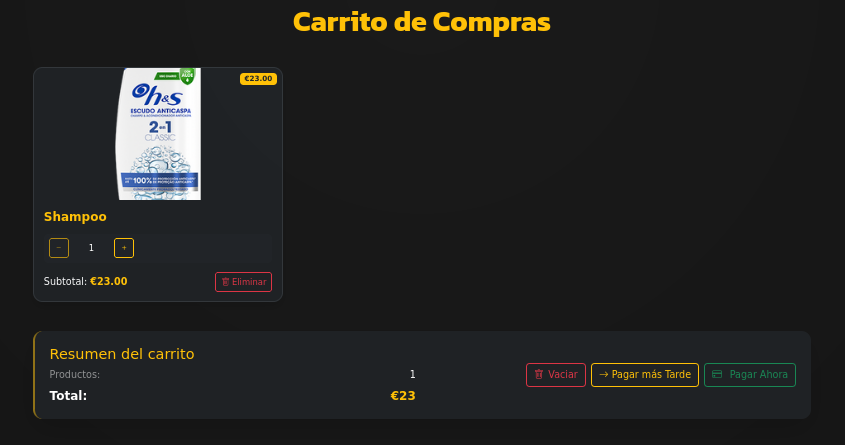
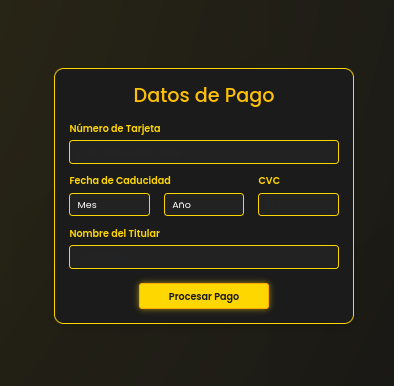

# Guia del Carrito de Compra

En cuanto al carrito se puede encontrar vacio que saldria esta pantalla que tiene un boton para redirigir a [productos](products.md)

Pero si el carrito tiene productos, se puede ver la siguiente pantalla con los productos que se han agrego con una forma de aumentar su cantidad y eliminarlos.

Tambien puedes elegir si pagarlo ya o mas tarde en el caso de que elijas que sea mas tarde se te redirige a la pantalla de [perfil](profile.md) pero si le das a pagar ahora te manda a la pasarela de pago que es la siguiente.

