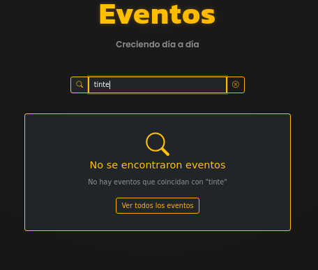

# Guia para Eventos

En esta pantalla podremos ver en forma de cartas todos los eventos que se han creado en la aplicación ademas de poder filtrar por su nombre.

Y en caso de que filtres por algo y no exista sale lo siguiente.

Y si pulsas en ver el curso te manda a una vista donde se ve mas detallada quedando de esta forma

