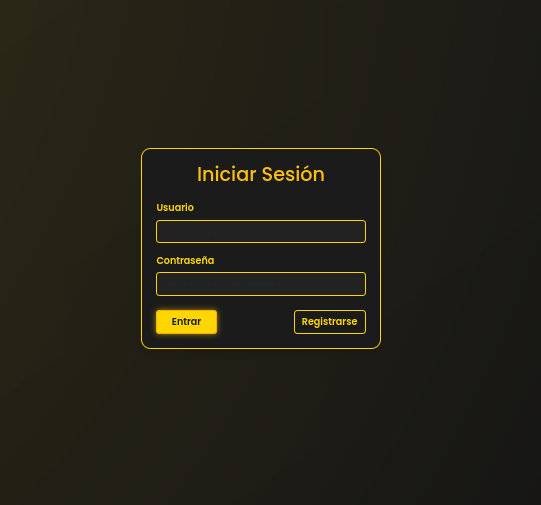
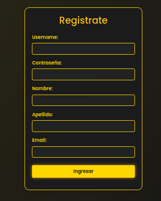

# Guia de autenticacion

Si en el [navbar](navbar.md) no te has logeado tendras que hacerlo para poder acceder a algunas paginas que si intentas entrar te redirigira al login que se ve de esta forma

Y si no tienes una cuenta a traves del boton de ese formulario puedes crear una.

Y despues de esto podras entrar a las paginas que tienes permitidas por tu rol.
