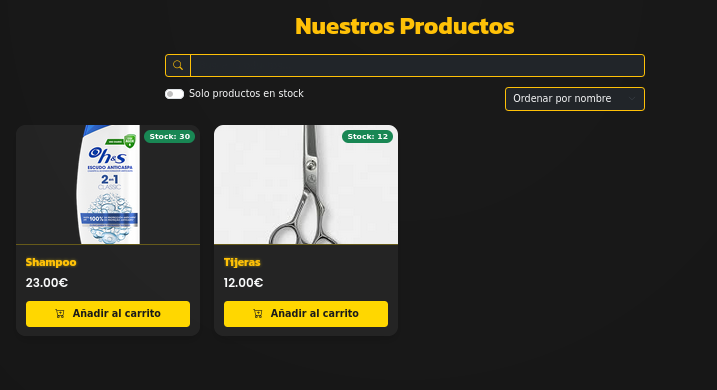
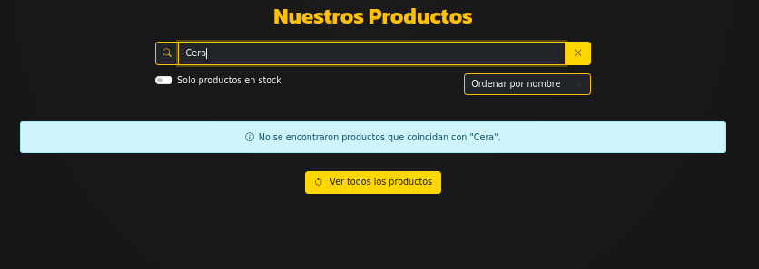

# Guia de Productos

En la pantalla de productos tienes todos lo productos que esten en la base de datos, puedes buscar por nombre, precio, a traves de los filtros que son opciones y tambien si escribes n el search se hara una busqueda por nombre ademas de que el toggle te muestra solo los productos que tengan stock.

Y si haces un filtro que no tenga ninguna coincidencia saldra lo siguiente.

Ademas si le das a añadir al carrito se añadira a el [carrito](cart.md) con las veces que le des a ese boton.
