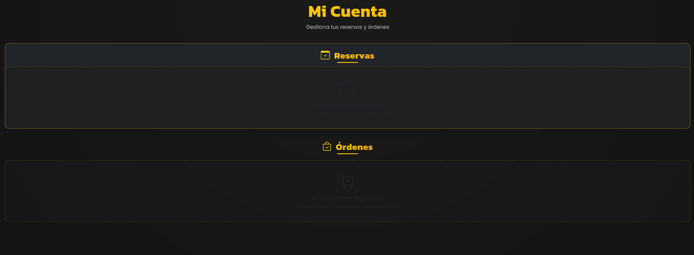
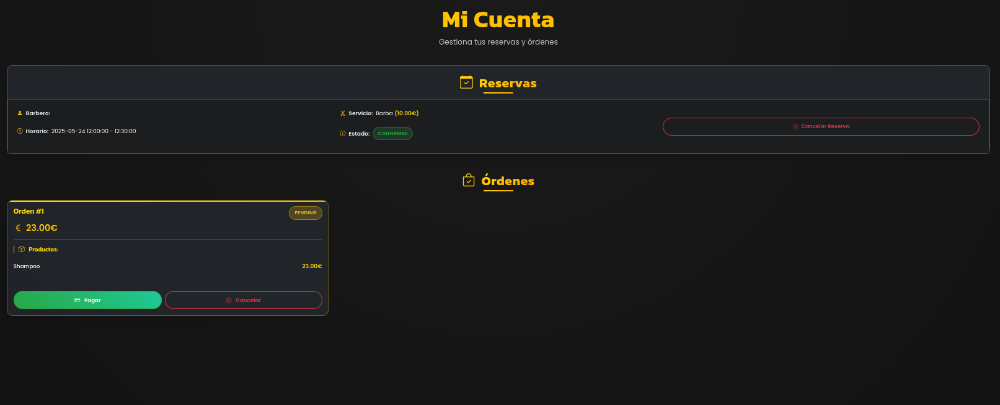

# Guía de el Profile

El profile es el sitio de la pagina que se accede cuando le das clic a tu nombre en la navbar despues de haber iniciado sesion . Aqui puedes encontrar la informacion de tus ordenes realizadas estando tanto las pendientes, pagadas y cancelladas con su precio y productos y tambien las reservas que tengas y no esten canceladas pudiendo cancelarlas desde aqui.

Este seria el profile antes de hacer ninguna reserva o pedido

Y este seria si haz echo alguna operacion

Los diferentes botones hacen que se hagan diferentes cosas de las que dicen.
Los pedidos al dar al pagar te redirige a la pasarela de pago y si le das a cancelar se devuelve el stock correspondiente a cada producto de la tienda.

Mientras que en las reservas si le das a cancelar se elimina la reserva de la base de datos. Para que quede libre esa hora para ese barbero y se pueda hacer otra reserva.
